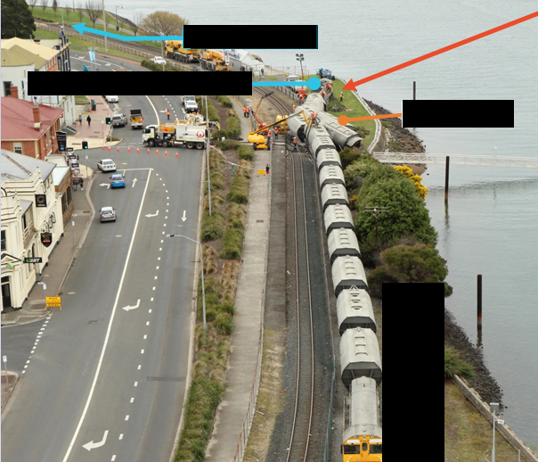
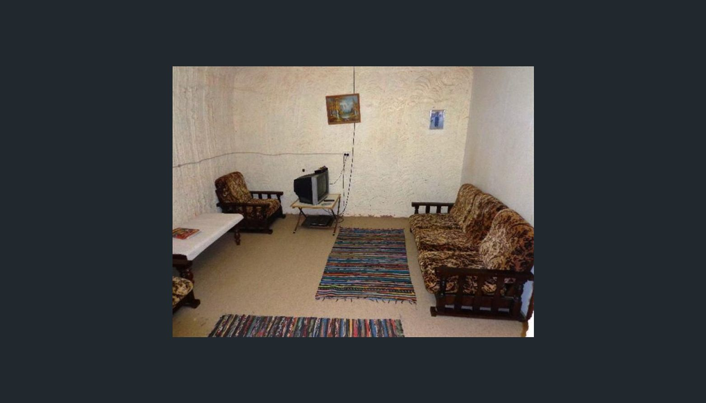

# Writeup

>~~This challenge would be "insane" if we had that level but hard will do :)~~ Maybe OTR3 isn't as insane as it was originally because we changed the description before we posted :/
>There are 2 sections/segments to the flag, each of the sections have two points of data that require you to actually solve rather than by guessing. Each section, each different point and space of the flag is separated by an underscore _ . All of these are Australian places.
>
>**Section 1:**
>Someone took the challenge name to heart, where was it coming from and the military time that it happened?
>`section_1.png` (sha256: 71596cff025472565970290dd0337c6b83e77b0a267ed2c144ebc0aeda0f2861)
>
>**Section 2:**
>We don't all live downunder(ground), and when we do its at 1134. What is the colour of the previous occupant's car and the name of the cereal?
>`section_2.jpg` (sha256: 9fbb694553e4dc82f2eeb5be1c8202b3be1f2208fc0c80682a9d58bc920b596c)
>
>Flag format: DUCTF{placeoforigin_militarytime_carcolour_nameofcereal} 

# Solve

There are two sections to this challenge and the writeup will be broken down into each one.

## Section 1:
>Someone took the challenge name to heart, where was it coming from and the military time that it happened?
>`section_1.png` (sha256: 71596cff025472565970290dd0337c6b83e77b0a267ed2c144ebc0aeda0f2861)

The hint given in this challenge is in the form of an image and the description, it also asking for the details to be used in the flag. The image:

We are given a redacted image of a freight train derailment. It appears to be along a body of water, taking note of the fact that the body of water curves out towards the top of the image indicating it may be a coastline and therefore somewhere by the ocean (coastline structure strongly indicates its not a river). The next step, you can research phrases like "freight train derailment near water australia" which will return results such as this from the [Guardian](https://www.theguardian.com/australia-news/2018/sep/21/pair-hurt-after-runaway-driverless-freight-train-derailed-in-tasmania). From the image results as well you could identify the yellow section of the train front or parts of the freight carriages. There was an unintended method of reversing this image on Bing reverse image search which brough up 3 images from this derailment just after slightly scrolling down/

The article states: The train was loaded with tonnes of cement and travelling at about 50km/h when multiple carriages left the tracks on the north Tasmanian city’s waterfront just after 9am on Friday. Which gives us the approximate time of 9am. From here you can search these terms like "freight train derailment tasmania 9am". However if you didn't find/read that particular article which had the time, you can also search up phrases like "Tasmanian train derailment" to which you will return the same results from the [ATSB](https://www.atsb.gov.au/publications/investigation_reports/2018/rair/ro-2018-014/) - the Australian Train Safety Bureau. Next, from the site you come across this description:

> At approximately 0846 on 21 September 2018, a TasRail freight train rolled away from a loading facility at Railton, Tasmania. There was no train crew on board the freight train at the time. The train travelled for about 21 km before being routed into a dead-end siding in Devonport. 
> At about 0909, the train collided with the end of a dead-end siding, destroyed a fence line, and travelled in a derailed state for about 60 m into a public area (Figure 1). Two pedestrians within the public area received minor injuries from fence debris.

You are also able to navigate to the preliminary report tab, which shows the un-redacted version of the image provided to confirm that this was the event.

From here the ATSB report, we can ascertain the military time of the accident that happened, "0909" and the origin of the train, "railton" therefore I had the first part of the flag: railton_0909

## Section 2:
>We don't all live downunder(ground), and when we do its at 1134. What is the colour of the previous occupant's car and the name of the cereal?
>`section_2.jpg` (sha256: 9fbb694553e4dc82f2eeb5be1c8202b3be1f2208fc0c80682a9d58bc920b596c)

The hint given in this challenge is in the form of an image and the description, it also asking for the details to be used in the flag. The image:

We are given an image of what appears to be a living/lounge room. There aren't many identifying point in the image though. The curved wall is the most standing out part of the image, which is an odd feature for a conventional house. The main hint is from the description "We do not all live downunder(ground)", which given that all the places are in Australia, we can reasonably sure we are looking for a place where everyone lives downunder(underground).

Searching phrases like "underground town Australia" will return results for a town called "Coober Pedy". The description asks for a the previous occupants car colour, which would indicate they no longer live at the house. This could be because they sold it. Having a probably general location, you are then able to work on narrowing it down. In the description it also states that when we do live downunder(ground), that "its at 1134",  so you are able to research phrases like "Coober Pedy 1134". This search returns results like a real estate listing on [realestate.com.au](https://www.realestate.com.au/sold/property-house-sa-coober+pedy-117234243) which has the last time the property sold in 2017.
The intended solve required people to go onto the realestate.com.au website, filter by sold and then enter "1134". 

From the listing, next you can browse through the photos and identify the cereal "Nutri Grain" in the bottom left corner of the 4th photo forming the 2nd part of the sections flag: *nutri_grain*. Then the 5th photo turned out to be the intial photo from the provided posting. Continuing through the images on the listing, *White* is the color of the only car visible in the 13th photo of the listing.

Therefore, you have both parts of the flag "white_nutri_grain"

Put the two parts together with the DUCTF wrapper and ended up with:
# Flag:  DUCTF{railton_0909_white_nutri_grain}
