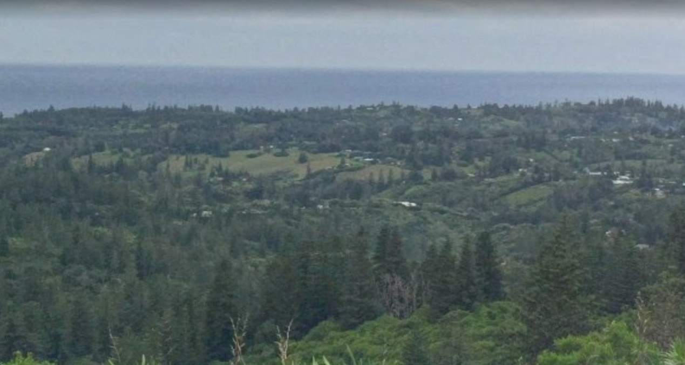
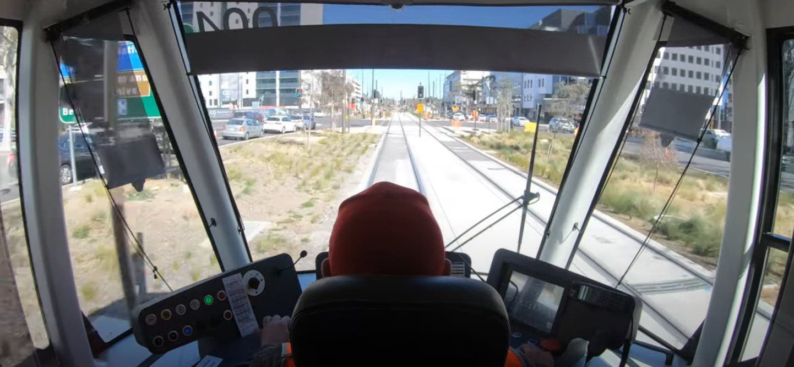

# Writeup

>This challenge would be "insane" if we had that level but hard will do :)
>
>There are 3 sections/segments to the flag, each of the sections have two points of data that require you to actually solve rather than by guessing. Each section, each different point and punctuation of the flag is separated by an underscore _. All of these Australian places.
>
>Section 1:
>How many cars were at this spot in 2018 and what is the siteID of the 1.77ghz?
>`section_1.jpg` (sha256: 2b2e7f49df1104d691cc836c6ef1d22c495119197d0f9a8504ae06da38d312d8)
>
>Section 2:
>How many times did the driver wave and what's the registration number?
>`section_2.png` (sha256: e3204ec879e77e3b22fed4bb8767e11ba40bc1860fe8ea9d88fb92d37811ba80)
>
>Section 3:
>We lost the war so we erected a metaphorical fence. Someone built an airstrip over it, what is the name of it and what is the postcode?
>
>Flag format: DUCTF{amountofcars_siteID_amountofwaves_registrationnumber_airstripname_postcode}

# Hints given 1 hour 15 before the competition ended
This time due to popular demand, here is a hint for Off the rails 4 - By unpopular demand
- Well we already gave you the registration
- The landing is rather rough on dirt and sand
- Wow the view from up here, and those trees!

# Solve

There are three sections to this challenge and the writeup will be broken down into each one.

## Section 1
>How many cars were at this spot in 2018 and what is the siteID of the 1.77ghz?
>`section_1.jpg` (sha256: 2b2e7f49df1104d691cc836c6ef1d22c495119197d0f9a8504ae06da38d312d8)

The hint given in this challenge is in the form of an image, the description is just asking for the details to be used in the flag. 
The image:

By taking the image provided and putting it into a reverse image search, you will get results for "pine trees", "cyprus pines" and "norfolk pines". From here there are multiple paths to the next step, the description states that all these are all Australian places.
You can search "pine trees australia", "norfolk pines australia", etc and there will be large amounts of references to Norfolk Island. From the photo we can see that there is a coastline of some description or what appears to be a large body of water that may imply it is an ocean.
Next, after ascertaining its Norfolk Island, the photo looks like its been taken from a high elevation, whether that be a hill, mountain, lookout, etc. By looking at high elevation points on mapping software, there are only a few high elevation points on Norfolk Island.
Through evaluating each of these points - that means looking at them, investigating if they are visually similar to the photo, you can pick out that it is Mount Pitt. The photo has a lot of tree coverage and there is one large area of dense tree coverage on Norfolk Island that consumes a fair portion of it, and the only mountains are in the dense trees in the national park.

From here you can search "mount", "lookout", etc. Most of these results will return Mt Pitt, which literally has the description "Car-accessible spot for views & picnics". One of many ways to do this is that the whole of Norfolk Island does not have google street view, however when on google maps, in the bottom right, there is a golden figure nicknamed unofficially as "street view dude"  that when selected will highlight where users are have uploaded photospheres.
With this you are also able to drag them over the elevated areas to look for photo spheres. On Mount Pitt, there are three photo spheres points, but there is only one of interest, this is the [photo sphere](https://www.google.com.au/maps/@-29.0158412,167.936854,3a,75y,112.09h,90t/data=!3m8!1e1!3m6!1sAF1QipNuoqDi52R8I6IHsRBfSs10CKVCDviv40haiqw!2e10!3e11!6shttps:%2F%2Flh5.googleusercontent.com%2Fp%2FAF1QipNuoqDi52R8I6IHsRBfSs10CKVCDviv40haiqw%3Dw203-h100-k-no-pi0-ya5.8957944-ro-0-fo100!7i8704!8i4352) from Alex Wolfson in 2018. That's the reference to the 2018 in the description, so when that photo sphere is view, you just need to count the cars, of which there were 2. 

Also on Mount Pitt from the satellite view or from the sphere view, you are able to see/locate anttenas/telecomunnications infrastructures. The description of siteID implies that where ever or whatever this is, it is a site and you are also given a frequency too.
There are again multiple paths you can take here, by searching terms like "frequency locator map" if you hadn't identified Norfolk Island or Mt Pitt yet then you could use a website like [ACMA](https://web.acma.gov.au/rrl/site_proximity.main_page) to filter there locations by the frequency given or you could look at the locator map over Norfolk Island or Mt Pitt and see the dots for the sites which when [clicked](https://web.acma.gov.au/rrl//site_search.site_lookup?pSITE_ID=10008340) provides details about the site including the siteID.
There were a number of different websites and tools you could use here to either filter the locations by frequency or look at the locations on a map. This part of the flag could be solved before finding Mt Pitt although that wasn't intended.

The site ID for the 1.77ghz frequency is 10008340 and there were 2 cars at the location.

## Section 2
>How many times did the driver wave and what's the registration number?
>`section_2.png` (sha256: e3204ec879e77e3b22fed4bb8767e11ba40bc1860fe8ea9d88fb92d37811ba80)

The hint given in this challenge is in the form of an image, the description is just asking for the details to be used in the flag. 
The image:

From the image straight away, the registration number is in the top left. We were going to remove this, but left it to see if people would notice. From the photo itself, you can work out that it is either light rail/trams or trains/heavy rail. If you thought it may be a train cab view, you are able to compare cabs on the web to see that these arent similar.
As well as the T on the traffic light indicates that the Tram has its own signal, but it has to give way at certain times to vehicles/pedestrians which isnt something that trains typically do. Most train lines also dont have concrete in the middle and will often have overhead powerlines.

After working out that is was a tram/light rail vehicle, you can determine a lot about the location. There are only a few tram lines within Australia, these are in Melbourne, Sydney, Gold Coast and Canberra. From here you could look at each of these and compare how they are different to the photo and identify that this is Canberra light rail. 
Otherwise in the left hand side, you can see CQ which if you research "CQ Australia" doesn't return anything, but you can use this to later confirm the location is Canberra as the building is "civil quarters" which can be found by searching "civil quarters canberra" to confirm that you have the right location for light rail. 
Other points of interest are the large, wide open streets which are notorious for the capital city, Canberra. The trees on the side aren't matured or have been planted recently which indicates this is a new addition. The concrete is white and shiny indicating it has been freshly laid. These points highlight that the light rail has only been recently added to the area, in a wide open street.
If you compare the other light rails, these may be some distinguishing features, but arguably the most distinguishing is the dedicated tramway which is the seperation of the light rail tracks from the other vehicles. One you have identified that it is Canberra, you can research phrases like "canberra light rail cab"  which will return this [video](https://www.youtube.com/watch?v=zypJkkM7DlY&vl=en).
Given that the image is static, and that there is motion blur and its asking for how many times they waved, it is implied that you need to find a video of some description. After you have the video, you just need to grab the registration number from the top left of the cab window (if you haven't already) and count the number of waves the driver does, which is 7 to both other light rail drivers and construction workers.

The image could be reversed searched for an unintended solve, this would bring up a video from the same youtuber of a cab video drive in Sydney, NSW. From there, you could go through the videos on the youtube channel and match the image to the thumbnail through features like the red hat.

The amount of waves was 7 and the registration number was 004.

## Section 3
>We lost the war so we erected a metaphorical fence. Someone built an airstrip over it, what is the name of it and what is the postcode?

This section doesn't have an image, just a written description as a hint. The reference to the war that was lost is the Emu War, you can find this by researching "wars australia lost", then you will get a lot of results returning military conflicts overseas as well as the emu war.
However, Australia has only lost 3 military wars, excluding the Emu War so this narrows down the wars they have participated in.
The emu war has a level of notorioty with it given that Australia formally lost the war with an animal. 

Here is an example search: 
- [Example 1](https://duckduckgo.com/?q=wars+australia+lost&ia=web)
- [Example 2](https://www.google.com/search?ei=OBJnX5jONJC_wAPf86GACg&q=wars+australia+lost)

The first link has the emu war as the first result for searching "wars austrlaia lost" and the images tab also has lots of result for the emu war.
The second link has the 9th link in the results for the emu war and if you click on the images tab, there are lots and lots of results again for the emu wars. 

Given that the "metaphorical fence was erected" and Australia is an island, this is a key giveaway that this **may** be a play on words. Moreover, if you research "emu war fence", there are a handful of results (links and images) that link to real, physical, tangible fences, however we want a metaphorical fence.
If you search "emu fence" for example on any mapping software in this example we used google maps, you have two drop down suggestion. Although entering the search doesn't resolve any location. The reference to someone building an airstrip over the "metaphorical fence" and that you require the postcode also suggests that you may need to find the location on a map.
By clicking either of the two dropdowns, ["emu fence road"](https://www.google.com/maps/search/Emu+Fence+Road,+South+Yilgarn+WA,+Australia/@-19.7735564,120.6476685,16z?hl=en-GB) or ["emu fence"](https://www.google.com/maps/place/Emu+Fence,+Emu+Fence+Road,+Skeleton+Rock+Yilgarn,+WA,+Australia/@-31.8262877,119.3950721,17z/data=!4m5!3m4!1s0x2a4a4cbc1c08bd59:0xddc899fb1555a1f8!8m2!3d-31.8222703!4d119.3994785?hl=en-GB) you are taken to two points very close to each other on the road. 
This is your metaphorical fence, it's not a physical or tangible fence, but a play on words that the road (and its given name) is a metaphorical fence. Now the second half of the challenge, "Someone built an airstrip over it" finding the airstrip that was built over the "metaphorical fence" aka the road. On maps, you can scroll through the maps and follow Emu fence road, until you come across the [Marvel Loch airstrip](https://www.google.com/maps/place/Marvel+Loch,+Ghooli+WA+6426) that crosses over.

The airstrip name was Marvel Loch (marvel_loch when formatted) and the postcode was 6426.

## Flag: DUCTF{2_10008340_7_004_marvel_loch_6426}
