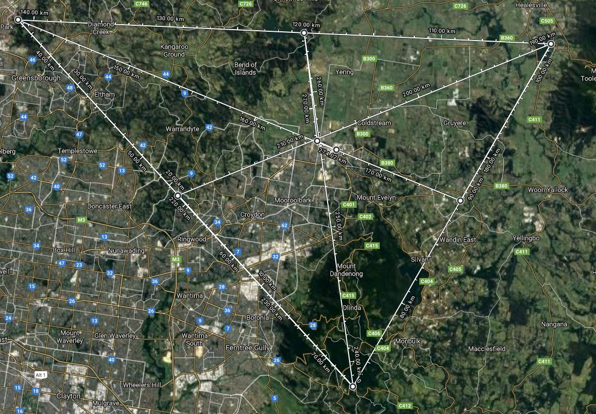
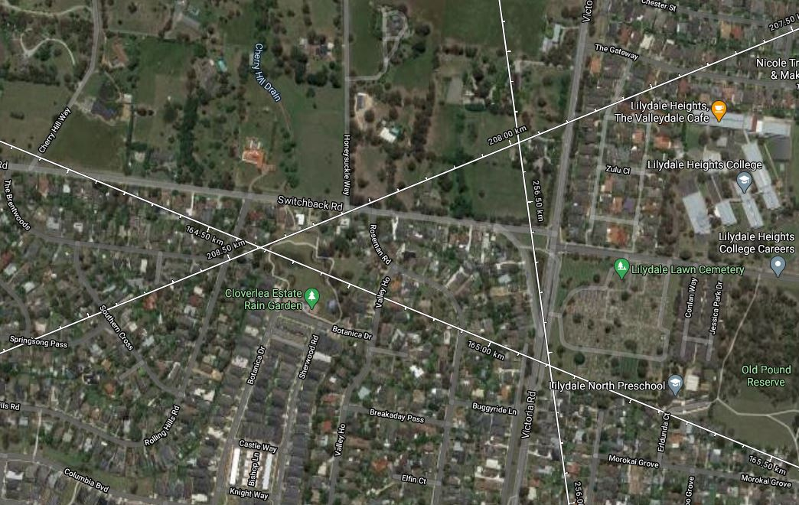
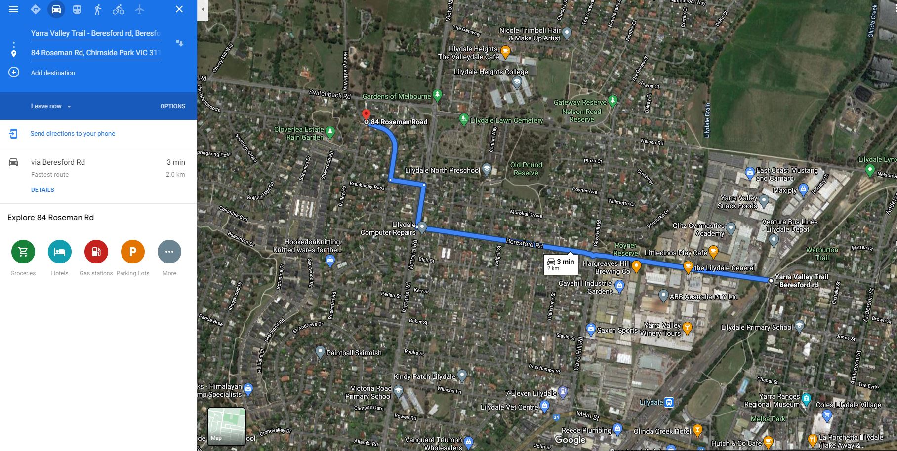
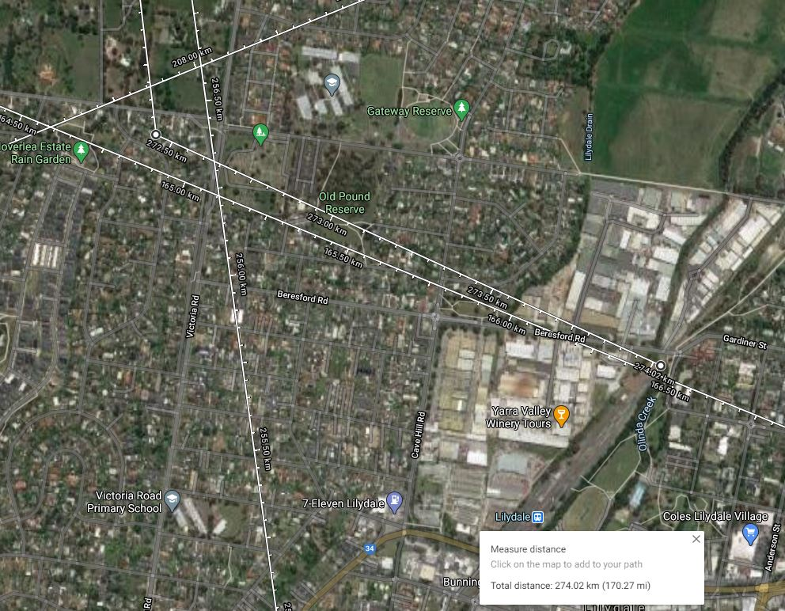
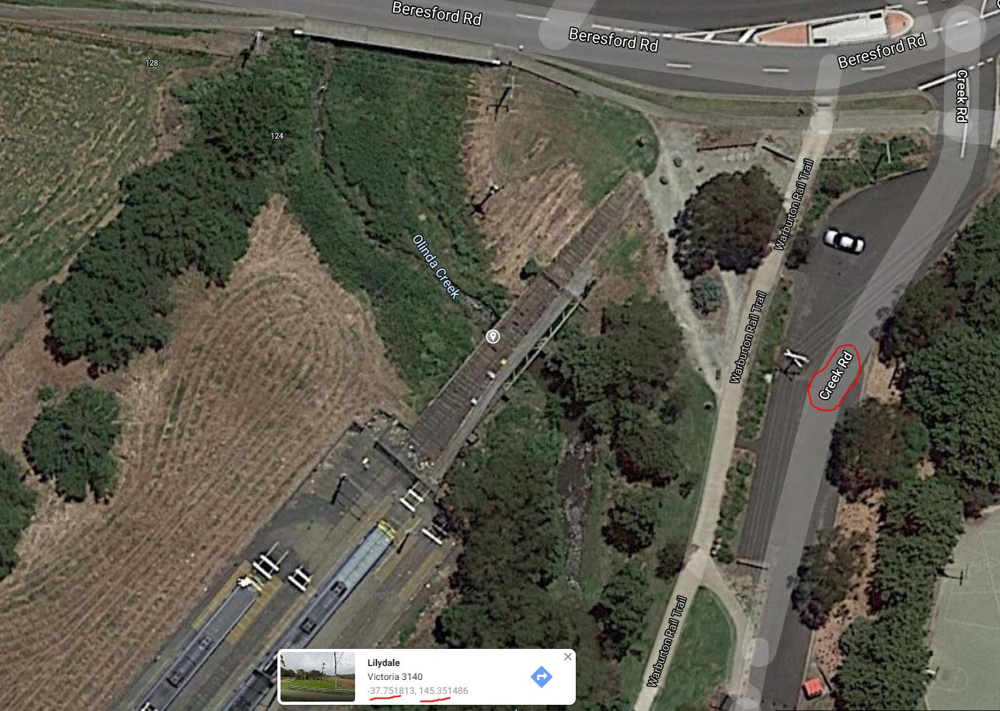

# Writeup

> **Off the Rails**
>
>I'm in trouble, I'm on the run... My friend told me he would meet me underneath a rail bridge 2km from his house before we escape on a train but he forgot to tell me where he lived.
>He took two day trips relatively close by and sent me two photos. **I also know that late last year, there was a fire near the suburbs approximately 25km from where he lives.**
>**He lives somewhere in the middle of those three points.** Could you tell me the name of the road parallel to the bridge, and the longitude and latitude of the bridge?
>P.S. The longitude and latitude should be to 3 decimal places (plus if necessary include the . and/or -). Each segement of the flag should be seperated by an underscore. The road name type should be the same as when you find it. The flag is also case insensitive.
>Example: DUCTF{longitude_latitude_nameofroad_roadnametype}

The first step to this challenge is to ascertain three locations/points based off the files and description. You are given two files "koala.jpg" and "on_track.jpg", as well as a description of an event to research.

The file "koala.png" is an image of a koala which has some interesting metadata consisting of a longitude and latitude of the first point, Healesville Sanctuary. 
This can be ascertained a handful of different ways, one way is through using a tool called 'EXIFTool' and examining the image metadata which will return the longitude and latitude. 
The image should not bring up any particular results in a reverse image search so you will need to rely on just the image metadata.

The other file "on_track.jpg" is an image of a trestle bridge. The type of bridge can be worked out either by searching and comparing images of train bridge style types or by reverse image searching with the results returning trestle bridges.
There are only a handful of trestle bridges left in the state of Victoria, let alone the rest of Australia which narrows the possibilities down quite far. If this is the first location/point that is being attempted, the scope may include the whole of Australia, but after solving "koala.jpg", it narrows it down to the state of Victoria.
In addition to researching and comparing trestle bridges in Victoria, if a reverse image search is performed, there are a selection of place names which are visually similar with one result that is of the place in question. 
Through research and comparison the bridge should be found, it can be found under two names being "puffing billy trestle bridge" or "monbulk creek trestle bridge" and has a distinctive curve to the bridge with sticking out beams that appear to be unique to that bridge only. 
The image will return at least one result with this trestle bridge, although it is quite far down. It also returns a handful of trestle bridges near to this one which may throw you off.

The description for the challenge tells about how there was a bushfire near the suburbs approximately 25km away late last year. 
Through research itself, you may find there were a large number of a bushfires last year in late 2019, however, only a handful burned near suburbs. If the other two locations are already solved, then Victoria is narrowed as the most suitable state for the bushfire to be in.
If this hasn't been narrowed down, then searching "bushfire suburbs late 2019" will return results including "https://www.theage.com.au/national/victoria/victoria-bushfires-live-extreme-fire-danger-as-temperatures-statewide-set-to-pass-40-degrees-20191229-p53ngs.html"
Which is a news blog/article that mentions the fire in question multiple times, the "Plenty Gorge bushfires" or "Mill Park bushfires".
If the state of Victoria was narrowed down from completing the earlier location/points, then some of the links refer to bushfires in early 2019, not late 2019. Almost all links have a mention of the correct fires by either of their given names, particularly if the search is narrowed down further by specifying December as opposed to "late".

From these three locations/points, a triangle can be formed over any mapping software, the one used was google maps. By drawing a line between the three points to form a triangle, we have a rough area of where their friend's house may be.
Next, refer back to the description stating that the house was roughly in the middle of these three points. If you connect a line from each point of the triangle to the center of the opposing side, you can form a intersection of the lines in roughly the middle of the triangle.
The accuracy of the points isn't essential as the intersection of the lines more than likely forms a smaller triangle in relatively the same area. Here is a suggestion of what the three points traced look like, as the points for the fire were different for everyone, the center triangle may be slightly different for each however this does not affect the final result unless you selected the suburb and not the fire location, which would be incorrect anyway.

Then the description states that the friend wanted to meet him underneath a rail bridge 2km from his house (which we have the rough area of) before they escape on a train together. From scanning the map or searching train lines in the near suburbs, the Lilydale line is the only **active** trainline nearby. The lilydale line used to have a continuation of the line out to both Healesville and Warburton, with lilydale station being the terminus. These were called the [Healesville line](https://en.wikipedia.org/wiki/Healesville_railway_line) and [Warburton line](https://en.wikipedia.org/wiki/Warburton_railway_line) respectively and remnants of both trails still remain. 

Being only 2km away from the area of the friends house, there are only a few rail bridges. Tthrough following the trainlines in the area and looking for environmental artifacts such as water/rivers/creeks that require a bridge to cross, there are not many on the line, and **only one** within the 2km radius of the approximate house area. 

There may have been other unintended ways to solve this challenge such as trial and error between all rail bridges in the 2km area (of which I recall 3). However, given the description that the person is on the run, the suspect is unlikely to want to be seen. They are also wanting to escape with a friend by catching a train. 

Therefore, the rail bridge chosen was the abandoned rail bridge just behind Lilydale station, where it crosses over Olinda Creek as part of the now abandoned Healesville and Warburton Lines.

Through right clicking on a tool like Google Maps and selecting "What's here?" we can secure the coordinates from the (roughly the middle of the) bridge. Then we look around for an parallel road as the challenge asks for, and the road parallel is Creek Rd.

The flag is case insensitive and uses the abbreviation of road as used on all tested mapping software (Google, Bing, Apple).

The original flag was this:
DUCTF{-37.751_145.351_creek_rd}

There were two errors with the flag (I take full blame for here). The first was that I specificied in the description that the format was (long, lat) where it was actually (lat, long) for the flag. Luckily it was only the first team to submit that had this as an issue, nobody else was affected by it. 

Unfortunately, I also realised that I forgot to round the 3 decimal place when the flag requirement was changed from 4 d.p. to 3 d.p. Therefore the original flag was incorrect when rounding to 3 d.p. which we noticed a few hours after we changed the requirement from 4 d.p. This issue affected two more teams initially, nobody else was affected by it.

We contacted the teams who submitted the correct flag where it was marked incorrect and they all re-submitted for the solve, we want to apologise to anyone that had issues with this challenge. To compensate for this, we changed the flags to then include .1/.2 for both the lat and long to eliminate any confusion or error with rounding as well as the reversed long, lat with the correct coords for anyone that may have not got the challenge update notification.

These were accepted as the final correct flags:
- DUCTF{-37.752_145.352_creek_rd}
- **DUCTF{-37.752_145.351_creek_rd}**	The actual correct flag.
- DUCTF{-37.751_145.352_creek_rd}	
- DUCTF{-37.751_145.351_creek_rd}
- DUCTF{145.351_-37.752_creek_rd}
