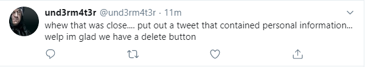
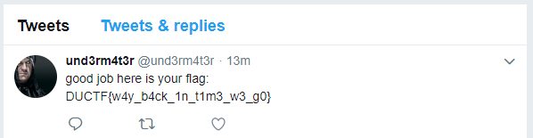

# Bad man
## Description
We have recently received reports about a hacker who goes by the alias `und3rm4t3r`. He has been threatening innocent people for money and must be stopped.
Help us find him and get us the flag.

## Solution
Checking the challenge description reveals a username `und3rm4t3r` . 
Upon searching the username on twitter we see an interesting profile with several tweets.

However this one sticks out:

Reading this reveals that the user deleted a tweet which was accidentally tweeted out.
So, checking the wayback machine for the users profile reveals that there was a snapshot of the page taken on 23th July and one of the tweets contain the flag.

Flag: DUCTF{w4y_b4ck_1n_t1m3_w3_g0}
