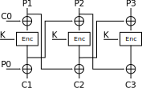

The mode of operation implemented in the script is similar to Telegram's Infinite Garble Extension mode. I first came across this on [CryptoHack](https://cryptohack.org/) (which is a great high-quality platform for learning crypto btw). The code provided is clear enough to read and draw a diagram from, so this prior knowledge is not necessary at all to solve the challenge.

After reading the source code, we figure that the mode of operation looks something like this:



We are given the AES key, the plaintext, and the ciphertext and the goal is to recover $C_0$ and $P_0$. Unfortunately, due to some bizarre cosmic ray interference, a lot of the data has been corrupted. We're given enough of the AES key, the complete first block of ciphertext, and enough of the last block of ciphertext. If we can completely recover the key and the ciphertext, we can recover the initialisation vectors (which hold the flag).

In the remaining explainations, we'll suppose for notational simplicity that the message is only 3 blocks and refer to the above diagram a lot. The reasoning is easily generalised to messages of aribtrary block length.

### Recovering the AES Key

The AES key is missing 3 nibbles, and the last block of ciphertext is missing 2 nibbles. It would take at most $16^5$ checks to bruteforce these nibbles, which is very feasible. Looking at the diagram above, we notice that

$$\begin{aligned} D(C_3 \oplus P_2) &= P_3 \oplus (C_2 \oplus P_1) \\ \implies C_2 &= D(C_3 \oplus P_2) \oplus P_3 \oplus P_1 \end{aligned}$$

and we know $C_3, P_1, P_2$ and $P_3$ (by bruteforcing the missing nibbles in $C_3$). We don't know $C_2$ completely though. In fact, it's missing 16 nibbles which is not feasible to bruteforce. It turns out that having only half of $C_2$ will suffice for allowing us to check if the key we guessed was correct. We'll simply check the nibbles that are present, and ignore the corrupted ones. It's very unlikely that we'll find a false positive doing this.

### Recovering the Ciphertext Blocks

Now that we have the AES key, it should be easy to recover the rest of the ciphertext as we can decrypt whatever ciphertext we want. Suppose in the above diagram, we want to find $C_2$. We have all of the plaintext blocks $P_1, P_2$ and $P_3$, as well as the ciphertext block $C_3$ (from the previous section). We have the exact same situation as before, except this time we know the key and $C_3$, so there's no brute forcing required. We simply compute

$$C_2 = D(C_3 \oplus P_2) \oplus P_3 \oplus P_1$$

In general, we have

$$C_{i-1} = D(C_i \oplus P_{i-1}) \oplus P_i \oplus P_{i-2}$$

Which will allow us to recover all of the corrupted ciphertext blocks!

### Recovering the Initialisation Vectors

We've now recovered all of the ciphertext. In the above diagram, $C_0$ and $P_0$ are the two halves of the flag. We can recover $C_0$ easily by observing that

$$D(C_2 \oplus P_1) = P_2 \oplus E(C_0 \oplus P_1)$$

so

$$C_0 = D(D(C_2 \oplus P_1) \oplus P_2) \oplus P_1$$

Now, we can recover $P_0$ since

$$E(P_1 \oplus C_0) = P_0 \oplus C_1$$

so

$$P_0 = E(P_1 \oplus C_0) \oplus C_1$$

We're lucky the cosmic rays didn't corrupt any of the first block of ciphertext! We wouldn't be able to determine $P_0$ otherwise.

**Solve script:**

```python
from Crypto.Util.Padding import pad
from Crypto.Cipher import AES
from Crypto.Util.strxor import strxor
from itertools import product
from tqdm import tqdm

hex_chars = '0123456789abcdef'

corrupted_key = '0▒9d0fe1920ca▒85e3851b162b8cc9▒5'
corrupted_ct = 'ed5dd65ef5ac36e886830cf006359b300▒1▒▒7▒▒▒▒▒▒c▒▒▒▒▒a▒▒▒▒▒8▒▒▒▒▒▒▒d6▒▒▒▒▒7▒▒▒▒b▒▒▒▒2▒▒▒▒▒▒▒▒▒f▒d▒0▒▒▒▒▒▒▒▒▒▒▒▒▒▒▒▒▒▒▒▒▒▒6▒▒▒▒▒▒▒▒▒▒▒▒▒f▒▒▒▒▒▒▒▒▒▒▒▒▒▒▒▒▒▒▒▒▒d▒▒b▒▒▒a▒▒▒▒▒e▒▒c▒▒▒▒▒2▒▒▒▒▒▒▒▒▒▒0▒▒3▒0c▒▒f▒▒▒▒▒▒▒▒▒▒▒▒1▒▒7▒▒▒▒▒▒▒▒▒▒▒▒▒1e▒▒0▒0▒▒▒▒▒9▒▒c▒▒e▒▒2▒▒4▒▒▒▒7▒▒▒▒▒0▒▒▒▒▒4▒▒▒▒▒▒▒▒f▒▒▒7▒▒▒▒▒e▒b▒▒9▒▒▒▒4▒f▒▒1▒c▒▒6▒0a▒3a0e6▒d7▒975d▒1cde66e41791b▒780988c9b8329'

def decrypt(ct, key):
    return AES.new(key, AES.MODE_ECB).decrypt(ct)

def replace_corrupted(c, replacements):
    for r in replacements:
        c = c.replace('▒', r, 1)
    return c

def equals_corrupted(c, m):
    for i in range(len(c)):
        if c[i] != '▒' and c[i] != m[i]:
            return False
    return True

def get_plaintext(key):
    msg = 'If Bruce Schneier multiplies two primes, the product is prime. On a completely unrelated note, the key used to encrypt this message is ' + key.hex()
    return pad(msg.encode(), 16)

def recover_key(corrupted_key, corrupted_c):
    for bf in tqdm(product(hex_chars, repeat=5), total=16**5):
        a,b,c,d,e = bf
        key = bytes.fromhex(replace_corrupted(corrupted_key, [a,b,c]))
        c3 = bytes.fromhex(replace_corrupted(corrupted_c[-32:], [d,e]))
        p1 = get_plaintext(key)[-48:-32]
        p2 = get_plaintext(key)[-32:-16]
        p3 = get_plaintext(key)[-16:]
        Ep2 = strxor(decrypt(strxor(c3, p2), key), p3)
        c2_guess = strxor(p1, Ep2)
        if equals_corrupted(corrupted_c[-64:-32], c2_guess.hex()):
            return key, c3

key, recovered_ct1 = recover_key(corrupted_key, corrupted_ct)
print('[+] key recovered:', key.hex())

msg = get_plaintext(key)
pt = [msg[i:i+16] for i in range(0, len(msg), 16)]

num_blocks = len(corrupted_ct)//32
ct = [bytes.fromhex(corrupted_ct[:32])] + ['?' for _ in range(num_blocks-1)] + [recovered_ct1]
for i in range(1, num_blocks-1):
    ct[-i-1] = strxor(strxor(decrypt(strxor(ct[-i], pt[-i-1]), key), pt[-i]), pt[-i-2])

print('[+] recovered ciphertext:\n\t' + '\n\t'.join(c.hex() for c in ct))

Ep1 = strxor(decrypt(strxor(ct[0], pt[0]), key), pt[1])

flag1 = strxor(decrypt(Ep1, key), pt[0]).decode()
flag2 = strxor(Ep1, ct[0]).decode()

print('[+] flag:', 'DUCTF{' + (flag1 + flag2) + '}')
```
