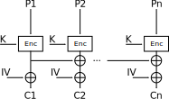
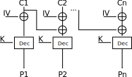
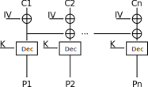

The server implements some weird mode of operation that looks something like this:

**encryption**



**decryption**



Note that the decryption function is actually broken, I made an implementation mistake (forgot an XOR, oops) and didn't realise until someone pointed it out during the CTF. This doesn't affect the solution or the challenge at all though, since you are only given the first block of ciphertext, and even with the implementation error, the first block of ciphertext decrypts properly. This is what it _should_ have looked like:



We can easily recover the first 16 bytes of the flag by asking for the decryption of the first 16 bytes of the ciphertext we receive. We can't do the same for the rest of the blocks though.

We quickly notice that if we can recover the IV, we can decrypt any block we want by asking for the decryption of `C_{i-1} xor IV xor C_i`.

We turn to the encryption part of the service to see how we can recover the IV. Notice how after a plaintext block passes through the block cipher, it is XORed with the encryption of the previous block (before the IV is applied). So, if we could somehow get the encryption of two identical blocks, the second block would be `0` after the "chaining" part (XORing with the previous encrypted plaintext block), and so after XORing with the IV, the result would be just the IV.

But we're only allowed to send one block of plaintext to be encrypted! Luckily, the server pads our message before encrypting it, as it is necessary for the message to be a multiple of the block length. [PCKS#7 padding](https://en.wikipedia.org/wiki/Padding_(cryptography)#PKCS#5_and_PKCS#7) is being used, so if we send a full block of 16s (`\x10\x10\x10\x10\x10\x10\x10\x10\x10\x10\x10\x10\x10\x10\x10\x10`), it will be padded out to *two* full blocks of 16s. This gives us our two identical plaintext blocks! It follows that the IV will be given to us in the 2nd ciphertext block.

We can then recover the rest of the flag as described above.

**Solve script:**

```python
from pwn import remote, xor
from Crypto.Util.Padding import unpad

def connect():
    return remote('0.0.0.0', 1337)

def recv(conn):
    o = conn.recvline().decode()
    print('[<]', o)
    return o

def send(conn, data):
    print('[>]', data)
    conn.sendline(data)

flag = b''

### retrieve first 16 bytes of the flag
conn = connect()
recv(conn)
ciphertext = recv(conn).split('read: ')[1]
num_blocks = len(ciphertext)//32
send(conn, 'aa'*16)
recv(conn)
send(conn, ciphertext[:32])
flag += bytes.fromhex(recv(conn).split(': ')[1])
conn.close()

### retrieve rest of the flag
for i in range(1, num_blocks):
    conn = connect()
    recv(conn)
    ciphertext = bytes.fromhex(recv(conn).split('read: ')[1])
    # recover IV by sending b'\x10'*16
    send(conn, (b'\x10'*16).hex())
    IV = bytes.fromhex(recv(conn).strip()[-32:])
    to_decrypt = xor(xor(IV, ciphertext[(i-1)*16:i*16]), ciphertext[i*16:(i+1)*16])
    send(conn, to_decrypt.hex())
    flag += bytes.fromhex(recv(conn).split(': ')[1])
    conn.close()

print('[*]', unpad(flag, 16).decode())
```
