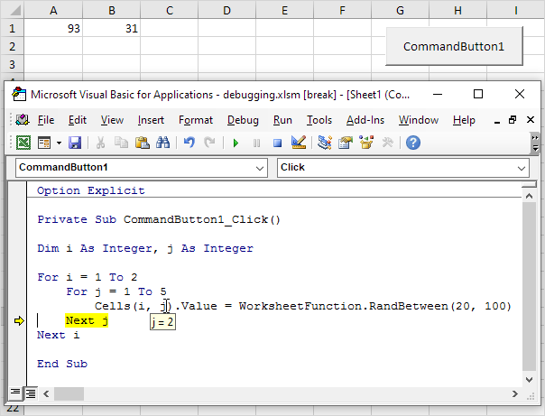

# im getting emotional

This is a VBA deobfuscation challenge. It's meant to educate the users about the current state of maldocs used in phishing campaigns, and make them learn how to analyze heavily obfuscated VB scripts.

It can either be very easy, very hard or very frustrating to the player (which makes a good CTF challenge!) - hence its medium.

The obfuscation is done with a very well thought out highschool project in 2018, https://github.com/bonnetn/vba-obfuscator/

The solve can pretty much summarized in this article https://www.excel-easy.com/vba/examples/debugging.html

The original code has a hardcoded flag, and asks for input from the user to enter the flag, then calls `strcomp` on it.

All the player has to do is set a breakpoint at where the flag variable might be called, and check its value. Most other fancy static analysis techniques on VBA and vipermonkey (a very good VBA macro emulator for obfuscated code) won't work, as I've tested them.

Solving: set a breakpoint at `strcomp`, and mouse over it to inspect the value fo the flat. Alternatively, use "add watchpoint" in Visual Basic Editor in Word.

